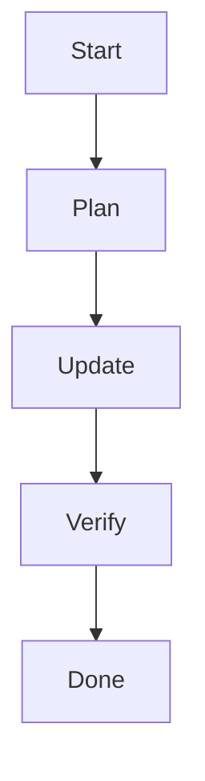

# Process Evolution Protocol

## Steps for Continuous Improvement
1. Read ALL Memory Bank files before planning or making changes.
2. Plan changes across all affected files and document rationale.
3. Update documentation before any implementation.
4. Use scripts for all file and directory changes.
5. Verify compliance, cross-references, and documentation completeness after each change.

## Guidance
- Follow these steps to ensure robust, context-rich, and error-resistant development.
- Reference this protocol in progress.md, activeContext.md, and all Memory Bank compliance sections.

### Mini Case
During the Python framework update, the team read all Memory Bank files,
planned script changes, updated documentation first, then implemented
`setup_python_docker.sh`. Verification scripts ensured compliance.
